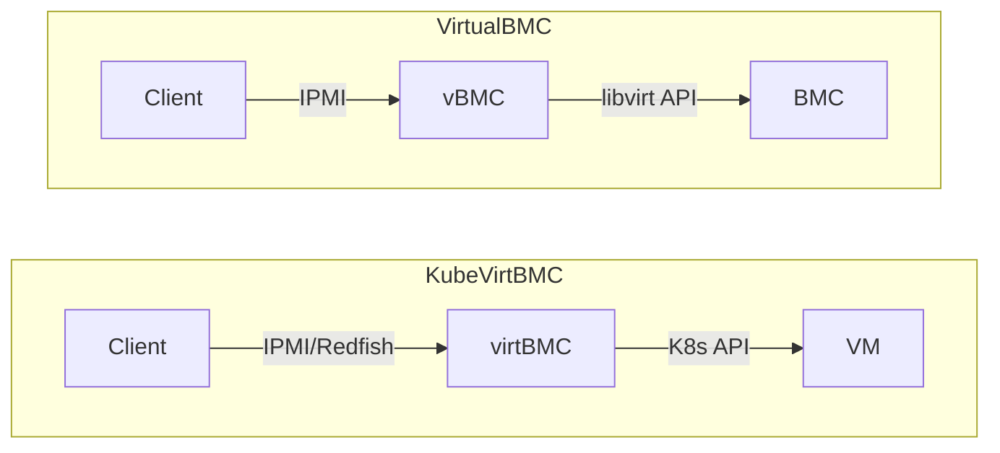
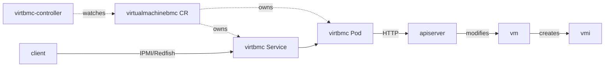

# KubeVirtBMC

[](https://github.com/starbops/kubevirtbmc/actions/workflows/main.yml)
[](https://github.com/starbops/kubevirtbmc/releases)

KubeVirtBMC unleashes the out-of-band management for virtual machines on Kubernetes in a traditional way, i.e., [IPMI](https://www.intel.com.tw/content/www/tw/zh/products/docs/servers/ipmi/ipmi-second-gen-interface-spec-v2-rev1-1.html) and [Redfish](https://www.dmtf.org/standards/redfish). This allows users to power on/off/reset and set the boot device for virtual machines. It was initially designed for [Tinkerbell](https://github.com/tinkerbell/tink)/[Seeder](https://github.com/harvester/seeder) to provision [KubeVirt](https://github.com/kubevirt/kubevirt) virtual machines, but as long as your provisioning tools play nicely with IPMI/Redfish, you can use KubeVirtBMC to manage your virtual machines on Kubernetes clusters.

The project was born in [SUSE Hack Week 23](https://hackweek.opensuse.org/) and augmented with Redfish in [SUSE Hack Week 24](https://hackweek.opensuse.org/24/projects/extending-kubevirtbmcs-capability-by-adding-redfish-support).

## Description

KubeVirtBMC was inspired by [VirtualBMC](https://opendev.org/openstack/virtualbmc). The difference between them could be illustrated as below:



**Goals**

- Providing a selective set of BMC functionalities for virtual machines powered by KubeVirt
- Providing accessibility through the network to the virtual BMCs of the VMs

**Non-goals**

- Providing BMC functionalities for bare-metal machines
- Providing BMC accessibility outside of the cluster via LoadBalancer or NodePort type of Services

KubeVirtBMC consists of two components:

- **virtbmc-controller**: A Kubernetes controller manager built with kubebuilder that reconciles on the VirtualMachineBMC, VirtualMachine, and Service objects
- **virtbmc**: A BMC emulator for serving IPMI/Redfish requests and translating them to native Kubernetes API requests

Below is the workflow of KubeVirtBMC when a VirtualMachine was created and booted up:



The VirtualMachineBMC CR (CustomResource):

```go
type VirtualMachineBMCSpec struct {
	// To authenticate who the user is.
	// +optional
	Username string `json:"username,omitempty"`

	// The credential part of the IPMI service
	// +optional
	Password string `json:"password,omitempty"`

	// The namespace where the virtual machine is in
	VirtualMachineNamespace string `json:"vmNamespace"`

	// The actual virtual machine that this BMC controls
	VirtualMachineName string `json:"vmName"`
}

// VirtualMachineBMCStatus defines the observed state of VirtualMachineBMC
type VirtualMachineBMCStatus struct {
	// The listen IP address for the IPMI service.
	ServiceIP string `json:"serviceIP"`

	// The indicator that shows the readiness of the IPMI service for the virtual machine
	Ready bool `json:"ready"`
}
```

## Getting Started

### Prerequisites

- go version v1.20.0+
- docker version 17.03+.
- kubectl version v1.11.3+.
- Access to a Kubernetes v1.11.3+ cluster.

### Develop

**Build and push the images:**

```sh
export PUSH=true
make docker-build
```

> **NOTE:** These images ought to be published in the personal registry you specified. And it is required to have access to pull the images from the working environment. Make sure you have the proper permission to the registry if the above commands don’t work.

**Install the CRDs into the cluster:**

```sh
make install
```

**Run the controller locally**

```sh
export ENABLE_WEBHOOKS=false
make run
```

**Generate the Redfish API and server stubs**

> **NOTE:** This section is only necessary if you want to change the Redfish schema version.

Download the Redfish schema from the DMTF website:

```sh
make download-redfish-schema
```

Normally, the OpenAPI spec file `hack/<REDFISH_SCHEMA_BUNDLE>/openapi/openapi.yaml` is the one you need. Copy it and modify it, make sure the changes are reflected in the file `hack/redfish/spec/openapi.yaml`. Then generate the code with openapi-generator:

```sh
make generate-redfish-api
```

The generated code will be placed in the `pkg/generated/redfish` directory.

You might also need to adjust the adapter and handler code because they are coupled with the Redfish schema at some degree.

### To Deploy on The Cluster

**Deploy cert-manager**

```sh
kubectl apply -f https://github.com/cert-manager/cert-manager/releases/download/v1.14.2/cert-manager.yaml
```

**Deploy the Manager to the cluster with the image specified by `IMG`:**

```sh
# Use the latest image at main-head
make deploy
# Or checkout to a specific branch/tag
git checkout <branch/tag>
make deploy
# Or specify the custom-built image
make deploy IMG=<some-registry>/virtbmc-controller:<tag>
```

> **NOTE**: If you encounter RBAC errors, you may need to grant yourself cluster-admin privileges or be logged in as admin.

### To Start Using The VirtualMachineBMC

Create the VirtualMachineBMC object in the cluster:

```sh
kubectl apply -f config/samples/virtualmachine_v1_virtualmachinebmc.yaml
```

Although you can manually create the VirtualMachineBMC object, the corresponding VirtualMachineBMC object should be created automatically when the VirtualMachine object exists. It will then scaffold the `*-virtbmc` Pod and Service object.

```sh
$ kubectl -n kubevirtbmc-system get svc
NAME                               TYPE        CLUSTER-IP      EXTERNAL-IP   PORT(S)   AGE
default-test-vm-virtbmc               ClusterIP   10.53.106.65    <none>        623/UDP   3h13m
```

To access the VM's BMC, you need to be in the cluster network. Run a Pod that comes with `ipmitool` built in:

```sh
kubectl run -it --rm ipmitool --image=mikeynap/ipmitool --command -- /bin/sh
```

Inside the Pod, you can for example turn on the VM via `ipmitool`:

```sh
$ ipmitool -I lan -U admin -P password -H default-test-vm-virtbmc.kubevirtbmc-system.svc.cluster.local power status
Chassis Power is off
$ ipmitool -I lan -U admin -P password -H default-test-vm-virtbmc.kubevirtbmc-system.svc.cluster.local power on
Chassis Power Control: Up/On
$ ipmitool -I lan -U admin -P password -H default-test-vm-virtbmc.kubevirtbmc-system.svc.cluster.local power status
Chassis Power is on
```

To access the Redfish API, you can use `curl`:

```sh
kubectl run -it --rm curl-redfish --image=curlimages/curl --command -- /bin/sh
```

Inside the Pod, you can operate the VM via Redfish APIs:

```sh
# Get the Redfish ServiceRoot
$ curl -L http://default-test-vm-virtbmc.kubevirtbmc-system.svc/redfish/v1
{"@odata.context":"/redfish/v1/$metadata#ServiceRoot.ServiceRoot","@odata.id":"/redfish/v1","@odata.type":"#ServiceRoot.v1_16_1.ServiceRoot","AccountService":{"@odata.id":"/redfish/v1/AccountService"},"AggregationService":{},"Cables":{},"CertificateService":{},"Chassis":{"@odata.id":"/redfish/v1/Chassis"},"ComponentIntegrity":{},"CompositionService":{"@odata.id":"/redfish/v1/CompositionService"},"Description":"ServiceRoot","EventService":{"@odata.id":"/redfish/v1/EventService"},"Fabrics":{},"Facilities":{},"Id":"","JobService":{},"JsonSchemas":{},"KeyService":{},"LicenseService":{},"Links":{"ManagerProvidingService":{"@odata.id":"/redfish/v1/Managers/BMC"},"Sessions":{"@odata.id":"/redfish/v1/SessionService/Sessions"}},"Managers":{"@odata.id":"/redfish/v1/Managers"},"NVMeDomains":{},"Name":"ServiceRoot","PowerEquipment":{},"ProtocolFeaturesSupported":{"DeepOperations":{},"ExpandQuery":{}},"RedfishVersion":"1.16.1","RegisteredClients":{},"Registries":{"@odata.id":"/redfish/v1/Registries"},"ResourceBlocks":{},"ServiceConditions":{},"SessionService":{"@odata.id":"/redfish/v1/SessionService"},"Storage":{},"StorageServices":{},"StorageSystems":{},"Systems":{"@odata.id":"/redfish/v1/Systems"},"Tasks":{"@odata.id":"/redfish/v1/Tasks"},"TelemetryService":{"@odata.id":"/redfish/v1/TelemetryService"},"ThermalEquipment":{},"UUID":"00000000-0000-0000-0000-000000000000","UpdateService":{"@odata.id":"/redfish/v1/UpdateService"}}

# Log in by creating a session
$ curl -i -X POST -H "Content-Type: application/json" http://default-test-vm-virtbmc.kubevirtbmc-system.svc/redfish/v1/SessionService/Sessions -d '{"UserName":"admin","Password":"password"}'
HTTP/1.1 201 Created
Content-Type: application/json; charset=UTF-8
Location: /redfish/v1/SessionService/Sessions/337bf6b2-e4c7-41c8-bfe4-fe3ee3ce40f2
X-Auth-Token: 55f88d07289cf1207b7b967f1823f5b28e08c8977f6c742f8175274afb214c93
Date: Wed, 18 Dec 2024 15:27:04 GMT
Content-Length: 225

{"@odata.id":"/redfish/v1/SessionService/Sessions/1","@odata.type":"Session.v1_7_1.Session","Actions":{},"Id":"337bf6b2-e4c7-41c8-bfe4-fe3ee3ce40f2","Links":{"OutboundConnection":{}},"Name":"User Session","UserName":"admin"}

# Get the System resource
$ curl -H "X-Auth-Token: 55f88d07289cf1207b7b967f1823f5b28e08c8977f6c742f8175274afb214c93" http://default-test-vm-virtbmc.kubevirtbmc-system.svc/redfish/v1/Systems/1
{"@odata.context":"/redfish/v1/$metadata#ComputerSystem.ComputerSystem","@odata.id":"/redfish/v1/Systems/1","@odata.type":"#ComputerSystem.v1_22_0.ComputerSystem","Actions":{"#ComputerSystem.AddResourceBlock":{},"#ComputerSystem.Decommission":{},"#ComputerSystem.RemoveResourceBlock":{},"#ComputerSystem.Reset":{"target":"/redfish/v1/Systems/1/Actions/ComputerSystem.Reset","title":"Reset"},"#ComputerSystem.SetDefaultBootOrder":{}},"AssetTag":"","Bios":{},"Boot":{"BootOptions":{},"BootSourceOverrideEnabled":"Disabled","BootSourceOverrideMode":"Legacy","BootSourceOverrideTarget":"Hdd","Certificates":{}},"BootProgress":{},"Certificates":{},"Composition":{},"Description":"Computer System","EthernetInterfaces":{},"FabricAdapters":{},"GraphicalConsole":{},"GraphicsControllers":{},"HostWatchdogTimer":{"FunctionEnabled":false,"Status":{},"TimeoutAction":""},"HostedServices":{"StorageServices":{}},"Id":"1","IdlePowerSaver":{},"IndicatorLED":"Unknown","KeyManagement":{"KMIPCertificates":{}},"LastResetTime":"0001-01-01T00:00:00Z","Links":{"HostingComputerSystem":{}},"LogServices":{},"Manufacturer":"KubeVirt","Memory":{},"MemoryDomains":{},"MemorySummary":{"Metrics":{},"Status":{},"TotalSystemMemoryGiB":0},"Model":"KubeVirt","Name":"default/test-vm","NetworkInterfaces":{"@odata.id":"/redfish/v1/Systems/1/NetworkInterfaces"},"OperatingSystem":"/redfish/v1/Systems/1/OperatingSystem","PartNumber":"","PowerState":"Off","ProcessorSummary":{"Count":0,"Metrics":{},"Status":{}},"Processors":{},"SKU":"","SecureBoot":{},"SerialConsole":{"IPMI":{},"SSH":{},"Telnet":{}},"SerialNumber":"000000000000","SimpleStorage":{"@odata.id":"/redfish/v1/Systems/1/SimpleStorage"},"Status":{},"Storage":{"@odata.id":"/redfish/v1/Systems/1/Storage"},"SystemType":"Virtual","USBControllers":{},"UUID":"00000000-0000-0000-0000-000000000000","VirtualMedia":{"@odata.id":"/redfish/v1/Systems/1/VirtualMedia"},"VirtualMediaConfig":{}}

# Set the boot device to PXE
$ curl -i -X PATCH -H "Content-Type: application/json" -H "X-Auth-Token: 55f88d07289cf1207b7b967f1823f5b28e08c8977f6c742f8175274afb214c93" http://default-test-vm-virtbmc.kubevirtbmc-system.svc/redfish/v1/Systems/1 -d '{"Boot":{"BootSourceOverrideTarget":"Pxe","BootSourceOverrideEnabled":"Continuous"}}'
HTTP/1.1 204 No Content
Content-Type: application/json; charset=UTF-8
Date: Wed, 18 Dec 2024 15:54:09 GMT

# Start the VM
$ curl -i -X POST -H "Content-Type: application/json" -H "X-Auth-Token: 55f88d07289cf1207b7b967f1823f5b28e08c8977f6c742f8175274afb214c93" http://default-test-vm-virtbmc.kubevirtbmc-system.svc/redfish/v1/Systems/1/Actions/ComputerSystem.Reset -d '{"ResetType":"On"}'
HTTP/1.1 204 No Content
Content-Type: application/json; charset=UTF-8
Date: Wed, 18 Dec 2024 15:59:25 GMT

# Reboot the VM
$ curl -i -X POST -H "Content-Type: application/json" -H "X-Auth-Token: 55f88d07289cf1207b7b967f1823f5b28e08c8977f6c742f8175274afb214c93" http://default-test-vm-virtbmc.kubevirtbmc-system.svc/redfish/v1/Systems/1/Actions/ComputerSystem.Reset -d '{"ResetType":"ForceRestart"}'
HTTP/1.1 204 No Content
Content-Type: application/json; charset=UTF-8
Date: Wed, 18 Dec 2024 16:02:49 GMT

# Stop the VM
$ curl -i -X POST -H "Content-Type: application/json" -H "X-Auth-Token: 55f88d07289cf1207b7b967f1823f5b28e08c8977f6c742f8175274afb214c93" http://default-test-vm-virtbmc.kubevirtbmc-system.svc/redfish/v1/Systems/1/Actions/ComputerSystem.Reset -d '{"ResetType":"GracefulShutdown"}'
HTTP/1.1 204 No Content
Content-Type: application/json; charset=UTF-8
Date: Wed, 18 Dec 2024 16:05:30 GMT

# Log out by deleting the session
$ curl -i -X DELETE -H "X-Auth-Token: 55f88d07289cf1207b7b967f1823f5b28e08c8977f6c742f8175274afb214c93" http://default-test-vm-virtbmc.kubevirtbmc-system.svc/redfish/v1/SessionService/Sessions/337bf6b2-e4c7-41c8-bfe4-fe3ee3ce40f2
HTTP/1.1 204 No Content
Content-Type: application/json; charset=UTF-8
Date: Wed, 18 Dec 2024 16:06:12 GMT
```

Due to the nature of the Redfish API, you can expose the Redfish service to the outside of the cluster with the aid of Ingress controllers. What's more, you can use cert-manager to issue a certificate for the Redfish service. To do so, you need to create an Ingress object (assuming you have an Ingress controller, e.g. `nginx-ingress`, and cert-manager installed) for each of the VirtualMachineBMC objects you want to expose:

```sh
kubectl apply -f config/samples/virtualmachine_v1_virtualmachinebmc_ingress.yaml
cat <<EOF | kubectl apply -f -
apiVersion: networking.k8s.io/v1
kind: Ingress
metadata:
  annotations:
    cert-manager.io/issuer: "kubevirtbmc-selfsigned-issuer"
  name: default-test-vm-virtbmc
  namespace: kubevirtbmc-system
spec:
  ingressClassName: nginx
  tls:
  - hosts:
    - default-test-vm-virtbmc.<ingress-nginx-lb-svc-ip>.sslip.io
    secretName: default-test-vm-virtbmc-tls
  rules:
  - host: default-test-vm-virtbmc.<ingress-nginx-lb-svc-ip>.sslip.io
    http:
      paths:
      - backend:
          service:
            name: default-test-vm-virtbmc
            port:
              number: 80
        path: /
        pathType: Prefix
EOF
```

In the end, you can access the Redfish service via `https://default-test-vm-virtbmc.<ingress-nginx-lb-svc-ip>.sslip.io` from anywhere.

### To Uninstall

**Delete the instances (CRs) from the cluster:**

```sh
kubectl delete -k config/samples/
```

**Delete the APIs (CRDs) from the cluster:**

```sh
make uninstall
```

**UnDeploy the controller from the cluster:**

```sh
make undeploy
```

## License

Copyright 2024 Zespre Chang <starbops@hey.com>

Licensed under the Apache License, Version 2.0 (the "License");
you may not use this file except in compliance with the License.
You may obtain a copy of the License at

    http://www.apache.org/licenses/LICENSE-2.0

Unless required by applicable law or agreed to in writing, software
distributed under the License is distributed on an "AS IS" BASIS,
WITHOUT WARRANTIES OR CONDITIONS OF ANY KIND, either express or implied.
See the License for the specific language governing permissions and
limitations under the License.
