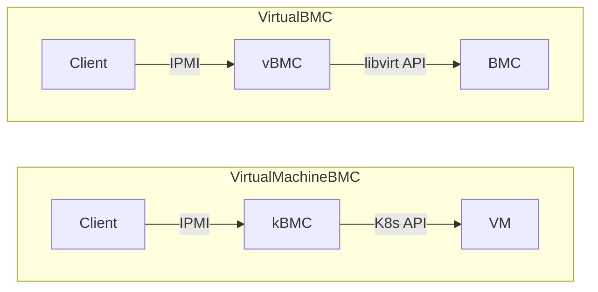
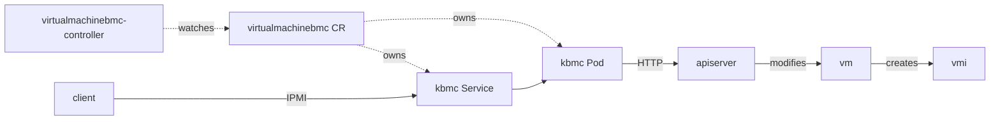

# VirtualMachineBMC

VirtualMachineBMC unleashes the power management for virtual machines on Kubernetes in a traditional way, i.e., [IPMI](https://www.intel.com.tw/content/www/tw/zh/products/docs/servers/ipmi/ipmi-second-gen-interface-spec-v2-rev1-1.html). This allows users to power on/off/reset and set the boot device for the VM. It was initially designed for [Tinkerbell](https://github.com/tinkerbell/tink)/[Seeder](https://github.com/harvester/seeder) to provision [KubeVirt](https://github.com/kubevirt/kubevirt) VMs, just like we did in the good old days.

The project was born in [SUSE Hack Week 23](https://hackweek.opensuse.org/).

## Description

VirtualMachineBMC was inspired by [VirtualBMC](https://opendev.org/openstack/virtualbmc). The difference between them could be illustrated below:



**Goals**

- Providing a subset of BMC functionalities for virtual machines powered by KubeVirt
- Providing in-cluster accessibility to the virtual BMCs of the VMs

**Non-goals**

- Providing BMC functionalities for bare-metal machines
- Providing BMC accessibility outside of the cluster via LoadBalancer or NodePort type of Services

VirtualMachineBMC consists of two components:

- **virtualmachinebmc-controller**: A typical Kubernetes controller built with kubebuilder that reconciles on the VirtualMachineBMC, VirtualMachine, and Service objects
- **kbmc**: A BMC simulator for serving IPMI and translating the requests to native Kubernetes API requests

Below is the workflow of VirtualMachineBMC when a VirtualMachine was created and booted up:



The VirtualMachineBMC CR (CustomResource):

```go
type VirtualMachineBMCSpec struct {
	// To authenticate who the user is.
	// +optional
	Username string `json:"username,omitempty"`

	// The credential part of the IPMI service
	// +optional
	Password string `json:"password,omitempty"`

	// The namespace where the virtual machine is in
	VirtualMachineNamespace string `json:"vmNamespace"`

	// The actual virtual machine that this BMC controls
	VirtualMachineName string `json:"vmName"`
}

// VirtualMachineBMCStatus defines the observed state of VirtualMachineBMC
type VirtualMachineBMCStatus struct {
	// The listen IP address for the IPMI service.
	ServiceIP string `json:"serviceIP"`

	// The indicator that shows the readiness of the IPMI service for the virtual machine
	Ready bool `json:"ready"`
}
```

## Getting Started

### Prerequisites

- go version v1.20.0+
- docker version 17.03+.
- kubectl version v1.11.3+.
- Access to a Kubernetes v1.11.3+ cluster.

### Develop

**Build and push the images to the location specified by `IMG`:**

```sh
make docker-build docker-push IMG=<some-registry>/virtualmachinebmc-controller:<tag>
make docker-build-kbmc docker-push IMG=<some-registry>/kbmc:<tag>
```

> **NOTE:** These images ought to be published in the personal registry you specified. And it is required to have access to pull the images from the working environment. Make sure you have the proper permission to the registry if the above commands don’t work.

**Install the CRDs into the cluster:**

```sh
make install
```

**Run the controller locally**

```sh
export ENABLE_WEBHOOKS=false
make run
```

### To Deploy on The Cluster

**Deploy cert-manager**

```sh
kubectl apply -f https://github.com/cert-manager/cert-manager/releases/download/v1.14.2/cert-manager.yaml
```

**Deploy the Manager to the cluster with the image specified by `IMG`:**

```sh
make deploy IMG=<some-registry>/virtualmachinebmc-controller:<tag>
```

> **NOTE**: If you encounter RBAC errors, you may need to grant yourself cluster-admin privileges or be logged in as admin.

### To Start Using The VirtualMachineBMC

Create the VirtualMachineBMC object in the cluster:

```sh
kubectl apply -f config/samples/virtualmachine_v1_virtualmachinebmc.yaml
```

Though you can create the VirtualMachineBMC object manually, the corresponding VirtualMachineBMC object should be created automatically when the VirtualMachine object exists. It will then scaffold the `*-kbmc` Pod and Service object.

```sh
$ kubectl -n virtualmachinebmc-system get svc
NAME                               TYPE        CLUSTER-IP      EXTERNAL-IP   PORT(S)   AGE
default-test-vm-kbmc               ClusterIP   10.53.106.65    <none>        623/UDP   3h13m
```

To access the VM's BMC, you need to be in the cluster network. Run a Pod that comes with `ipmitool` built in:

```sh
$ kubectl run -it --rm ipmitool --image=mikeynap/ipmitool --command -- /bin/sh
```

Inside the Pod, you can for example turn on the VM via `ipmitool`:

```sh
$ ipmitool -I lan -U admin -P password -H default-test-vm-kbmc.virtualmachinebmc-system.svc.cluster.local power status
Chassis Power is off
$ ipmitool -I lan -U admin -P password -H default-test-vm-kbmc.virtualmachinebmc-system.svc.cluster.local power on
Chassis Power Control: Up/On
$ ipmitool -I lan -U admin -P password -H default-test-vm-kbmc.virtualmachinebmc-system.svc.cluster.local power status
Chassis Power is on
```

### To Uninstall

**Delete the instances (CRs) from the cluster:**

```sh
kubectl delete -k config/samples/
```

**Delete the APIs (CRDs) from the cluster:**

```sh
make uninstall
```

**UnDeploy the controller from the cluster:**

```sh
make undeploy
```

## License

Copyright 2023 Zespre Chang <starbops@hey.com>

Licensed under the Apache License, Version 2.0 (the "License");
you may not use this file except in compliance with the License.
You may obtain a copy of the License at

    http://www.apache.org/licenses/LICENSE-2.0

Unless required by applicable law or agreed to in writing, software
distributed under the License is distributed on an "AS IS" BASIS,
WITHOUT WARRANTIES OR CONDITIONS OF ANY KIND, either express or implied.
See the License for the specific language governing permissions and
limitations under the License.
