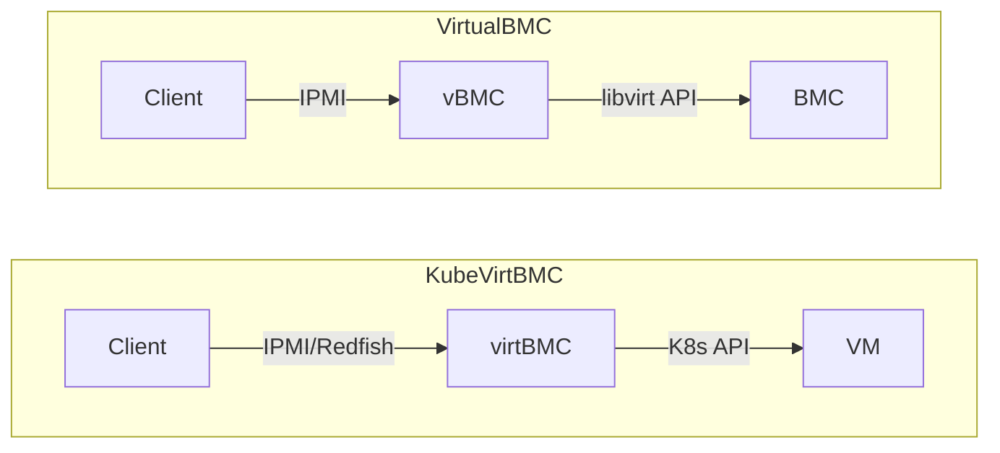
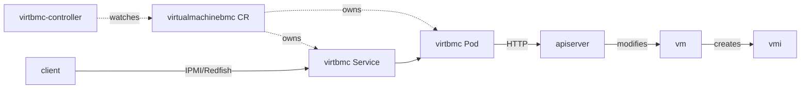

# KubeVirtBMC

[](https://github.com/starbops/kubevirtbmc/actions/workflows/main.yml)
[](https://github.com/starbops/kubevirtbmc/releases)

KubeVirtBMC unleashes the out-of-band management for virtual machines on Kubernetes in a traditional way, i.e., [IPMI](https://www.intel.com.tw/content/www/tw/zh/products/docs/servers/ipmi/ipmi-second-gen-interface-spec-v2-rev1-1.html) and [Redfish](https://www.dmtf.org/standards/redfish). This allows users to power on/off/reset and set the boot device for virtual machines. It was initially designed for [Tinkerbell](https://github.com/tinkerbell/tink)/[Seeder](https://github.com/harvester/seeder) to provision [KubeVirt](https://github.com/kubevirt/kubevirt) virtual machines, but as long as your provisioning tools play nicely with IPMI/Redfish, you can use KubeVirtBMC to manage your virtual machines on Kubernetes clusters.

The project was born in [SUSE Hack Week 23](https://hackweek.opensuse.org/) and augmented with Redfish in [SUSE Hack Week 24](https://hackweek.opensuse.org/24/projects/extending-kubevirtbmcs-capability-by-adding-redfish-support). The Redfish virtual media service has been supported after [Hack Week 25](https://hackweek.opensuse.org/25/projects/preparing-kubevirtbmc-for-project-transfer-to-the-kubevirt-organization).

## Quick Start

Install cert-manager first as it is required for the webhook service and the Redfish API:

```sh
helm upgrade --install cert-manager cert-manager \
    --repo=https://charts.jetstack.io \
    --namespace=cert-manager \
    --create-namespace \
    --version=v1.19.2 \
    --set=crds.enabled=true
```

Install KubeVirtBMC with Helm. Optionally, you can specify the image repository and tag, e.g., `--set image.repository=starbops/virtbmc-controller --set image.tag=v0.4.1`:

```sh
# Install the chart from the remote repository
helm repo add kubevirtbmc https://charts.zespre.com/
helm repo update
helm upgrade --install kubevirtbmc kubevirtbmc/kubevirtbmc \
    --namespace=kubevirtbmc-system \
    --create-namespace

# Or, install the chart locally, with the bleeding-edge image, i.e., `starbops/virtbmc-controller:main-head`
git clone https://github.com/starbops/kubevirtbmc.git
cd kubevirtbmc/
helm upgrade --install kubevirtbmc ./deploy/charts/kubevirtbmc \
    --namespace=kubevirtbmc-system \
    --create-namespace \
    --set=image.tag=main-head
```

## Project Description

KubeVirtBMC was inspired by [VirtualBMC](https://opendev.org/openstack/virtualbmc). The difference between them could be illustrated as below:



**Goals**

- Providing a selective set of BMC functionalities for virtual machines powered by KubeVirt
- Providing accessibility through the network to the virtual BMCs of the virtual machines

**Non-goals**

- Providing BMC functionalities for bare-metal machines
- ~~Providing BMC accessibility outside of the cluster via LoadBalancer or NodePort type of Services~~

KubeVirtBMC consists of two components:

- **virtbmc-controller**: A Kubernetes controller manager built with kubebuilder that reconciles on the VirtualMachineBMC and other relevant resources
- **virtbmc**: A BMC emulator for serving IPMI/Redfish requests and translating them to native Kubernetes API requests to get information from the virtual machine or even take actions on it

Below is the workflow of KubeVirtBMC when a VirtualMachine was created and booted up:



Take a peek at the VirtualMachineBMC CRD (Custom Resource Definition):

```go
// Condition type constant.
const (
	ConditionReady = "Ready"
)

// VirtualMachineBMCSpec defines the desired state of VirtualMachineBMC.
type VirtualMachineBMCSpec struct {
	// Reference to the VM to manage.
	VirtualMachineRef *corev1.LocalObjectReference `json:"virtualMachineRef,omitempty"`

	// Reference to the Secret containing IPMI/Redfish credentials.
	AuthSecretRef *corev1.LocalObjectReference `json:"authSecretRef,omitempty"`
}

// VirtualMachineBMCStatus defines the observed state of VirtualMachineBMC.
type VirtualMachineBMCStatus struct {
	// IP address exposed by the BMC service
	ClusterIP string `json:"clusterIP,omitempty"`

	// List of current conditions (e.g., Ready)
	Conditions []metav1.Condition `json:"conditions,omitempty"`
}
```

## Getting Started

### Prerequisites

- Go version v1.24.0+
- Docker version 28.5+.
- kubectl version v1.32.0+.
- Access to a Kubernetes v1.32.0+ cluster.
- KubeVirt v1.6.0+.

### Develop

**Build and push the images:**

```sh
export PUSH=true
make docker-build

# For building multi-arch images
make docker-buildx
```

> **NOTE:** These images ought to be published in the personal registry you specified. And it is required to have access to pull the images from the working environment. Make sure you have the proper permission to the registry if the above commands don’t work.

**Install the CRDs into the cluster:**

```sh
make install
```

**Run the controller locally**

```sh
export ENABLE_WEBHOOKS=false
make run
```

**Generate the Redfish API and server stubs**

> [!NOTE] This section is only necessary if you want to change the Redfish schema version.

Download the Redfish schema from the DMTF website:

```sh
make download-redfish-schema
```

Normally, the OpenAPI spec file `hack/<REDFISH_SCHEMA_BUNDLE>/openapi/openapi.yaml` is the one you need. Copy it and modify it, make sure the changes are reflected in the file `hack/redfish/spec/openapi.yaml`. Then generate the code with openapi-generator:

```sh
make generate-redfish-api
```

The generated code will be placed in the `pkg/generated/redfish` directory.

> [!NOTE] You might also need to adjust the adapter and handler code because they are coupled with the Redfish schema at some degree.

### Deploy

**Deploy cert-manager**

```sh
kubectl apply -f https://github.com/cert-manager/cert-manager/releases/download/v1.19.2/cert-manager.yaml
```

**Deploy the Manager to the cluster with the image specified by `IMG`:**

```sh
# Use the latest image at main-head
make deploy

# Or checkout to a specific branch/tag
git checkout <branch/tag>
make deploy

# Or specify the custom-built image
make deploy IMG=<some-registry>/virtbmc-controller:<tag>
```

> [!NOTE] If you encounter RBAC errors, you may need to grant yourself cluster-admin privileges or be logged in as admin.

### Interact with Virtual BMCs

**Set up the virtual BMC**

In order to have a functioning virtual BMC, the virtual machine and the BMC credentials refered by the to-be-created VirtualMachineBMC resource need to be created first. Here is an example of them:

```yaml
---
apiVersion: kubevirt.io/v1
kind: VirtualMachine
metadata:
  name: test-vm
  namespace: default
spec:
  runStrategy: Halted
  template:
    metadata:
      labels:
        kubevirt.io/domain: test-vm
    spec:
      domain:
        cpu:
          cores: 2
        devices:
          disks:
          - cdrom:
              bus: sata
            name: cdrom
          interfaces:
          - name: default
            masquerade: {}
        features:
          acpi:
            enabled: true
        firmware:
          bootloader:
            efi:
              secureBoot: false
        machine:
          type: q35
        memory:
          guest: 4Gi
        resources:
          limits:
            cpu: "2"
            memory: 4Gi
      hostname: test-vm
      networks:
      - name: default
        pod: {}
      evictionStrategy: LiveMigrateIfPossible
---
apiVersion: v1
kind: Secret
metadata:
  name: vmbmc-auth-secret
  namespace: default
data:
  password: cGFzc3dvcmQ= # password
  username: YWRtaW4=     # admin
```

After creating the above resources, it's time for the VirtualMachineBMC resource:

```sh
cat <<EOF | kubectl apply -f -
apiVersion: bmc.kubevirt.io/v1beta1
kind: VirtualMachineBMC
metadata:
  name: test-vmbmc
  namespace: default
spec:
  virtualMachineRef:
    name: test-vm
  authSecretRef:
    name: vmbmc-auth-secret
EOF
```

You can check the just-created VirtualMachineBMC resource and see whether it's ready to serve:

```sh
$ kubectl get virtualmachinebmcs test-vmbmc -o yaml
apiVersion: bmc.kubevirt.io/v1beta1
kind: VirtualMachineBMC
metadata:
  annotations:
    kubectl.kubernetes.io/last-applied-configuration: |
      {"apiVersion":"bmc.kubevirt.io/v1beta1","kind":"VirtualMachineBMC","metadata":{"annotations":{},"name":"test-vmbmc","namespace":"default"},"spec":{"authSecretRef":{"name":"vmbmc-auth-secret"},"virtualMachineRef":{"name":"test-vm"}}}
  creationTimestamp: "2025-12-10T05:44:54Z"
  generation: 1
  name: test-vmbmc
  namespace: default
  resourceVersion: "670418"
  uid: 1446bab2-0186-465e-ba02-ef5d5ed22df2
spec:
  authSecretRef:
    name: vmbmc-auth-secret
  virtualMachineRef:
    name: test-vm
status:
  clusterIP: 10.53.220.67
  conditions:
  - lastTransitionTime: "2025-12-10T05:44:54Z"
    message: ClusterIP assigned to the Service
    reason: ServiceReady
    status: "True"
    type: Ready
```

Behind the scenes, KubeVirtBMC automatically creates the dedicated Pod and Service to provide the virtual BMC functionality for the virtual machine you specified. You can verify it by running the get command with the label:

```sh
$ kubectl get pods,services -l kubevirt.io/virtualmachinebmc-name=test-vmbmc
NAME                  READY   STATUS    RESTARTS   AGE
pod/test-vm-virtbmc   1/1     Running   0          37s

NAME                      TYPE        CLUSTER-IP     EXTERNAL-IP   PORT(S)          AGE
service/test-vm-virtbmc   ClusterIP   10.53.220.67   <none>        623/UDP,80/TCP   37s
```

**Access virtual BMC via IPMI**

To access the virtual BMC via IPMI, you need to be in the cluster network. Run a Pod that comes with `ipmitool` built in:

```sh
kubectl run -it --rm ipmitool --image=mikeynap/ipmitool --command -- /bin/sh
```

Inside the Pod, you can for example turn on the virtual machine via `ipmitool`:

```sh
# Get the power status of the virtual machine
$ ipmitool -I lan -U admin -P password -H test-vm-virtbmc.default.svc.cluster.local power status
Chassis Power is off

# Turn on the virtual machine
$ ipmitool -I lan -U admin -P password -H test-vm-virtbmc.default.svc.cluster.local power on
Chassis Power Control: Up/On

# Wait a few seconds and then get the power status again
$ ipmitool -I lan -U admin -P password -H test-vm-virtbmc.default.svc.cluster.local power status
Chassis Power is on
```

**Access virtual BMC via Redfish**

To access the virtual BMC through the Redfish API, you can use `curl`:

```sh
kubectl run -it --rm curl-redfish --image=curlimages/curl --command -- /bin/sh
```

Inside the Pod, you can operate the virtual machine via Redfish APIs:

```sh
# Get the Redfish ServiceRoot
$ curl -L http://test-vm-virtbmc.default.svc/redfish/v1
{"@odata.context":"/redfish/v1/$metadata#ServiceRoot.ServiceRoot","@odata.id":"/redfish/v1","@odata.type":"#ServiceRoot.v1_16_1.ServiceRoot","AccountService":{"@odata.id":"/redfish/v1/AccountService"},"AggregationService":{},"Cables":{},"CertificateService":{},"Chassis":{"@odata.id":"/redfish/v1/Chassis"},"ComponentIntegrity":{},"CompositionService":{"@odata.id":"/redfish/v1/CompositionService"},"Description":"ServiceRoot","EventService":{"@odata.id":"/redfish/v1/EventService"},"Fabrics":{},"Facilities":{},"Id":"","JobService":{},"JsonSchemas":{},"KeyService":{},"LicenseService":{},"Links":{"ManagerProvidingService":{"@odata.id":"/redfish/v1/Managers/BMC"},"Sessions":{"@odata.id":"/redfish/v1/SessionService/Sessions"}},"Managers":{"@odata.id":"/redfish/v1/Managers"},"NVMeDomains":{},"Name":"ServiceRoot","PowerEquipment":{},"ProtocolFeaturesSupported":{"DeepOperations":{},"ExpandQuery":{}},"RedfishVersion":"1.16.1","RegisteredClients":{},"Registries":{"@odata.id":"/redfish/v1/Registries"},"ResourceBlocks":{},"ServiceConditions":{},"SessionService":{"@odata.id":"/redfish/v1/SessionService"},"Storage":{},"StorageServices":{},"StorageSystems":{},"Systems":{"@odata.id":"/redfish/v1/Systems"},"Tasks":{"@odata.id":"/redfish/v1/Tasks"},"TelemetryService":{"@odata.id":"/redfish/v1/TelemetryService"},"ThermalEquipment":{},"UUID":"00000000-0000-0000-0000-000000000000","UpdateService":{"@odata.id":"/redfish/v1/UpdateService"}}

# Log in by creating a session
$ curl -i -X POST -H "Content-Type: application/json" http://test-vm-virtbmc.default.svc/redfish/v1/SessionService/Sessions -d '{"UserName":"admin","Password":"password"}'
HTTP/1.1 201 Created
Content-Type: application/json; charset=UTF-8
Location: /redfish/v1/SessionService/Sessions/337bf6b2-e4c7-41c8-bfe4-fe3ee3ce40f2
X-Auth-Token: 55f88d07289cf1207b7b967f1823f5b28e08c8977f6c742f8175274afb214c93
Date: Wed, 18 Dec 2024 15:27:04 GMT
Content-Length: 225

{"@odata.id":"/redfish/v1/SessionService/Sessions/1","@odata.type":"Session.v1_7_1.Session","Actions":{},"Id":"337bf6b2-e4c7-41c8-bfe4-fe3ee3ce40f2","Links":{"OutboundConnection":{}},"Name":"User Session","UserName":"admin"}

# Get the System resource
$ curl -H "X-Auth-Token: 55f88d07289cf1207b7b967f1823f5b28e08c8977f6c742f8175274afb214c93" http://test-vm-virtbmc.default.svc/redfish/v1/Systems/1
{"@odata.context":"/redfish/v1/$metadata#ComputerSystem.ComputerSystem","@odata.id":"/redfish/v1/Systems/1","@odata.type":"#ComputerSystem.v1_22_0.ComputerSystem","Actions":{"#ComputerSystem.AddResourceBlock":{},"#ComputerSystem.Decommission":{},"#ComputerSystem.RemoveResourceBlock":{},"#ComputerSystem.Reset":{"target":"/redfish/v1/Systems/1/Actions/ComputerSystem.Reset","title":"Reset"},"#ComputerSystem.SetDefaultBootOrder":{}},"AssetTag":"","Bios":{},"Boot":{"BootOptions":{},"BootSourceOverrideEnabled":"Disabled","BootSourceOverrideMode":"Legacy","BootSourceOverrideTarget":"Hdd","Certificates":{}},"BootProgress":{},"Certificates":{},"Composition":{},"Description":"Computer System","EthernetInterfaces":{},"FabricAdapters":{},"GraphicalConsole":{},"GraphicsControllers":{},"HostWatchdogTimer":{"FunctionEnabled":false,"Status":{},"TimeoutAction":""},"HostedServices":{"StorageServices":{}},"Id":"1","IdlePowerSaver":{},"IndicatorLED":"Unknown","KeyManagement":{"KMIPCertificates":{}},"LastResetTime":"0001-01-01T00:00:00Z","Links":{"HostingComputerSystem":{}},"LogServices":{},"Manufacturer":"KubeVirt","Memory":{},"MemoryDomains":{},"MemorySummary":{"Metrics":{},"Status":{},"TotalSystemMemoryGiB":0},"Model":"KubeVirt","Name":"default/test-vm","NetworkInterfaces":{"@odata.id":"/redfish/v1/Systems/1/NetworkInterfaces"},"OperatingSystem":"/redfish/v1/Systems/1/OperatingSystem","PartNumber":"","PowerState":"Off","ProcessorSummary":{"Count":0,"Metrics":{},"Status":{}},"Processors":{},"SKU":"","SecureBoot":{},"SerialConsole":{"IPMI":{},"SSH":{},"Telnet":{}},"SerialNumber":"000000000000","SimpleStorage":{"@odata.id":"/redfish/v1/Systems/1/SimpleStorage"},"Status":{},"Storage":{"@odata.id":"/redfish/v1/Systems/1/Storage"},"SystemType":"Virtual","USBControllers":{},"UUID":"00000000-0000-0000-0000-000000000000","VirtualMedia":{"@odata.id":"/redfish/v1/Systems/1/VirtualMedia"},"VirtualMediaConfig":{}}

# Set the boot device to PXE
$ curl -i -X PATCH -H "Content-Type: application/json" -H "X-Auth-Token: 55f88d07289cf1207b7b967f1823f5b28e08c8977f6c742f8175274afb214c93" http://test-vm-virtbmc.default.svc/redfish/v1/Systems/1 -d '{"Boot":{"BootSourceOverrideTarget":"Pxe","BootSourceOverrideEnabled":"Continuous"}}'
HTTP/1.1 204 No Content
Content-Type: application/json; charset=UTF-8
Date: Wed, 18 Dec 2024 15:54:09 GMT

# Start the virtual machine
$ curl -i -X POST -H "Content-Type: application/json" -H "X-Auth-Token: 55f88d07289cf1207b7b967f1823f5b28e08c8977f6c742f8175274afb214c93" http://test-vm-virtbmc.default.svc/redfish/v1/Systems/1/Actions/ComputerSystem.Reset -d '{"ResetType":"On"}'
HTTP/1.1 204 No Content
Content-Type: application/json; charset=UTF-8
Date: Wed, 18 Dec 2024 15:59:25 GMT

# Reboot the virtual machine
$ curl -i -X POST -H "Content-Type: application/json" -H "X-Auth-Token: 55f88d07289cf1207b7b967f1823f5b28e08c8977f6c742f8175274afb214c93" http://test-vm-virtbmc.default.svc/redfish/v1/Systems/1/Actions/ComputerSystem.Reset -d '{"ResetType":"ForceRestart"}'
HTTP/1.1 204 No Content
Content-Type: application/json; charset=UTF-8
Date: Wed, 18 Dec 2024 16:02:49 GMT

# Stop the virtual machine
$ curl -i -X POST -H "Content-Type: application/json" -H "X-Auth-Token: 55f88d07289cf1207b7b967f1823f5b28e08c8977f6c742f8175274afb214c93" http://test-vm-virtbmc.default.svc/redfish/v1/Systems/1/Actions/ComputerSystem.Reset -d '{"ResetType":"GracefulShutdown"}'
HTTP/1.1 204 No Content
Content-Type: application/json; charset=UTF-8
Date: Wed, 18 Dec 2024 16:05:30 GMT

# Log out by deleting the session
$ curl -i -X DELETE -H "X-Auth-Token: 55f88d07289cf1207b7b967f1823f5b28e08c8977f6c742f8175274afb214c93" http://test-vm-virtbmc.default.svc/redfish/v1/SessionService/Sessions/337bf6b2-e4c7-41c8-bfe4-fe3ee3ce40f2
HTTP/1.1 204 No Content
Content-Type: application/json; charset=UTF-8
Date: Wed, 18 Dec 2024 16:06:12 GMT
```

You can even attach/detach an ISO image to the virtual machine with the Redfish virtual media function:

```sh
# Insert virtual media to the virtual machine
$ curl -i -X POST -H "Content-Type: application/json" -H "X-Auth-Token: 55f88d07289cf1207b7b967f1823f5b28e08c8977f6c742f8175274afb214c93" http://test-vm-virtbmc.default.svc/redfish/v1/Managers/BMC/VirtualMedia/CD1/Actions/VirtualMedia.InsertMedia -d '{"Image": "https://releases.ubuntu.com/noble/ubuntu-24.04.3-live-server-amd64.iso", "Inserted": true}'

# Get virtual media status
$ curl -i -H "X-Auth-Token: 55f88d07289cf1207b7b967f1823f5b28e08c8977f6c742f8175274afb214c93" http://test-vm-virtbmc.default.svc/redfish/v1/Managers/BMC/VirtualMedia/CD1
{"@odata.context":"/redfish/v1/$metadata#VirtualMedia.VirtualMedia","@odata.id":"/redfish/v1/Managers/BMC/VirtualMedia/CD1","@odata.type":"#VirtualMedia.v1_6_3.VirtualMedia","Actions":{"#VirtualMedia.EjectMedia":{},"#VirtualMedia.InsertMedia":{}},"Certificates":{},"ClientCertificates":{},"ConnectedVia":"URI","Description":"Virtual Media","Id":"CD1","Image":"https://releases.ubuntu.com/noble/ubuntu-24.04.3-live-server-amd64.iso","ImageName":"","Inserted":true,"MediaTypes":["CD","DVD"],"Name":"Virtual Media","Status":{},"WriteProtected":false}

# Eject virtual media from the virtual machine
$ curl -i -X POST -H "Content-Type: application/json" -H "X-Auth-Token: 55f88d07289cf1207b7b967f1823f5b28e08c8977f6c742f8175274afb214c93" http://test-vm-virtbmc.default.svc/redfish/v1/Managers/BMC/VirtualMedia/CD1/Actions/VirtualMedia.EjectMedia -d '{}'
```

Under the hood, KubeVirtBMC's Redfish virtual media function is backed by KubeVirt's `DeclarativeHotplugVolumes` feature and CDI DataVolume. As a result, you need to enable the feature gate and have CDI installed in the cluster as prerequisites. For each virtual machine that you want to use the virtual media function, its VirtualMachine resource must have a CD-ROM disk defined as a stub for volume hotplug. For instance:

```yaml
        ...
        devices:
          disks:
          - cdrom:       # The cdrom stub must exist before using the virtual media function
              bus: sata
            name: cdrom  # The name of the CD-ROM disk can be any
        ...
```

**Expose the Redfish API to external**

Due to the nature of the Redfish API, you can expose the Redfish service to the outside of the cluster with the aid of Ingress controllers. What's more, you can use cert-manager to issue a certificate for the Redfish service.

Here, we will use the self-signed issuer type as an example (please note the security implications; for more details, see https://cert-manager.io/docs/configuration/selfsigned/). To do so, you can to create an Issuer resource in the namespace same as the VirtualMachineBMC resource:

```yaml
apiVersion: cert-manager.io/v1
kind: Issuer
metadata:
  name: kubevirtbmc-selfsigned-issuer
  namespace: default
spec:
  selfSigned: {}
```

Next, create an Ingress resource (assuming you have an Ingress controller, e.g., `nginx-ingress`, installed) for each VirtualMachineBMC resource you want to expose:

```sh
cat <<EOF | kubectl apply -f -
apiVersion: networking.k8s.io/v1
kind: Ingress
metadata:
  annotations:
    cert-manager.io/issuer: "kubevirtbmc-selfsigned-issuer"
  name: test-vm-virtbmc
  namespace: default
spec:
  ingressClassName: nginx
  tls:
  - hosts:
    - test-vm-virtbmc.default.<ingress-nginx-lb-svc-ip>.sslip.io
    secretName: test-vm-virtbmc-tls
  rules:
  - host: test-vm-virtbmc.default.<ingress-nginx-lb-svc-ip>.sslip.io
    http:
      paths:
      - backend:
          service:
            name: test-vm-virtbmc
            port:
              number: 80
        path: /
        pathType: Prefix
EOF
```

In the end, you can access the Redfish service via `https://test-vm-virtbmc.default.<ingress-nginx-lb-svc-ip>.sslip.io/redfish/v1` from anywhere.

### To Uninstall

**Delete the instances (CRs) from the cluster:**

```sh
kubectl delete kubevirtbmcs test-vmbmc
```

**Delete the APIs (CRDs) from the cluster:**

```sh
make uninstall
```

**UnDeploy the controller from the cluster:**

```sh
make undeploy
```

## License

Copyright 2024 Zespre Chang <starbops@hey.com>

Licensed under the Apache License, Version 2.0 (the "License");
you may not use this file except in compliance with the License.
You may obtain a copy of the License at

    http://www.apache.org/licenses/LICENSE-2.0

Unless required by applicable law or agreed to in writing, software
distributed under the License is distributed on an "AS IS" BASIS,
WITHOUT WARRANTIES OR CONDITIONS OF ANY KIND, either express or implied.
See the License for the specific language governing permissions and
limitations under the License.
